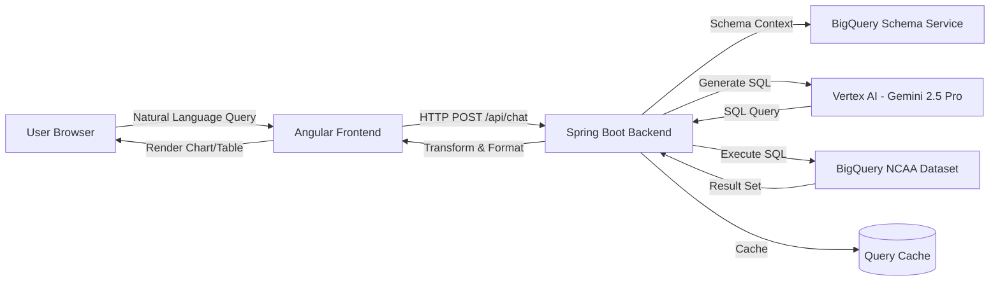

# raga-aidev Organization

Welcome to **raga-aidev**, an organization focused on building intelligent, AI-powered data analysis tools that make complex datasets accessible through natural language interfaces.

## 🎯 Mission

Our mission is to democratize data analytics by leveraging cutting-edge AI technologies to transform natural language questions into actionable insights, beautiful visualizations, and intuitive user experiences.

## 🚀 Current Projects

### RAG Chatbot (NCAA Basketball Analytics)

An intelligent chatbot system that enables users to query NCAA basketball data using natural language. The system leverages Google Cloud's Vertex AI and BigQuery to generate SQL queries, execute them, and present results through dynamic visualizations.

**Key Features:**
- Natural language to SQL translation using Google's Gemini 2.5 Pro
- Intelligent visualization selection (line charts, bar charts, pie charts, bubble charts, tables)
- Multi-series temporal analysis support
- Real-time query execution with caching
- Modern glass-morphism UI with responsive design
- Interactive Plotly.js charts with hover details and legends

**Projects:**
- **ragchatbot-be**: Spring Boot backend service ([detailed docs](../ragchatbot-be.md))
- **ragchatbot-fe**: Angular frontend application ([detailed docs](../ragchatbot-fe.md))

## 🛠️ Technology Stack

### Backend
- **Runtime**: Java 17+
- **Framework**: Spring Boot 3.x
- **Build Tool**: Gradle
- **AI/ML**: Google Cloud Vertex AI (Gemini 2.5 Pro)
- **Data Source**: Google Cloud BigQuery
- **Architecture**: RESTful API with Strategy and Factory patterns

### Frontend
- **Framework**: Angular 18+ (Standalone Components)
- **Language**: TypeScript
- **Charts**: Plotly.js
- **State Management**: RxJS Observables
- **Styling**: Glass-morphism CSS with custom properties

### Cloud Infrastructure
- **Cloud Provider**: Google Cloud Platform (GCP)
- **AI Service**: Vertex AI for natural language processing
- **Database**: BigQuery for scalable data analytics
- **Authentication**: Application Default Credentials (ADC)

## 📚 Project Documentation

### Quick Links
- [Backend Architecture Deep Dive](../ragchatbot-be.md) - Comprehensive guide to the Spring Boot backend
- [Frontend Architecture Deep Dive](../ragchatbot-fe.md) - Complete Angular frontend documentation
- [Backend README](../../ragchatbot-be/README.md) - Setup and development guide
- [Frontend README](../../ragchatbot-fe/README.md) - Setup and development guide

## 🏗️ System Architecture Overview



The system follows a clean architecture with clear separation of concerns:
1. **Frontend**: Handles user interaction and visualization rendering
2. **Backend API**: Orchestrates AI, data processing, and formatting
3. **AI Layer**: Vertex AI generates SQL from natural language
4. **Data Layer**: BigQuery executes queries on NCAA basketball dataset
5. **Cache Layer**: Stores query results for fast retrieval

## 🎨 Design Philosophy

### Backend Design Principles
- **Strategy Pattern**: Pluggable visualization strategies for different chart types
- **Factory Pattern**: Dynamic transformer selection based on data structure
- **Template Method**: Consistent response formatting with customizable templates
- **Separation of Concerns**: Clear boundaries between AI, data, and presentation layers

### Frontend Design Principles
- **Component-Based**: Modular, reusable Angular standalone components
- **Reactive Programming**: RxJS observables for async operations
- **Type Safety**: Strict TypeScript with comprehensive interfaces
- **Responsive Design**: Mobile-first approach with glassmorphism aesthetics

## 🚦 Getting Started

### Prerequisites
- **Java 17+** and **Gradle** (for backend)
- **Node.js 18+** and **npm/bun** (for frontend)
- **Google Cloud Project** with Vertex AI and BigQuery enabled
- **GCP Credentials** configured (Application Default Credentials)

### Quick Start

#### Backend Setup
```bash
cd ragchatbot-be
./gradlew bootRun
```
Server starts on `http://localhost:8080`

#### Frontend Setup
```bash
cd ragchatbot-fe
npm install
npm start
```
Application available at `http://localhost:4200`

### Configuration

#### Backend (`ragchatbot-be/src/main/resources/application.properties`)
```properties
gcp.project-id=your-gcp-project-id
gcp.vertexai.location=us-central1
gcp.vertexai.model=gemini-2.5-pro
gcp.bigquery.dataset=bigquery-public-data
gcp.bigquery.schema=ncaa_basketball
```

#### Frontend (`ragchatbot-fe/proxy.conf.json`)
```json
{
  "/api": {
    "target": "http://localhost:8080",
    "secure": false
  }
}
```

## 🧪 Testing

### Backend Tests
```bash
cd ragchatbot-be
./gradlew test
```

### Frontend Tests
```bash
cd ragchatbot-fe
npm test
```

## 📖 Key Concepts

### Natural Language to SQL
The system uses Google's Gemini 2.5 Pro model to convert user questions into BigQuery SQL:
- Schema context is provided to the model
- Intelligent prompting guides SQL generation
- Safety validation prevents dangerous operations
- Completeness checks ensure executable queries

### Intelligent Visualization Selection
The backend automatically selects the best visualization based on:
- **Query Intent**: Comparison, trend, distribution, correlation
- **Data Structure**: Column types, row counts, temporal signals
- **User Hints**: Explicit chart type requests in natural language

Supported visualizations:
- **Line Charts**: Single-series trends over time
- **Multi-Line Charts**: Multi-series temporal comparisons
- **Bar Charts**: Categorical comparisons and rankings
- **Pie Charts**: Distribution and percentage breakdowns
- **Bubble Charts**: Multi-metric correlation analysis
- **Tables**: Detailed data display fallback

### Caching Strategy
Queries are cached based on SQL signature:
- Fast response for repeated queries
- Reduces API calls to Vertex AI
- Maintains query history for analysis
- Stored in `logs/sql-queries.json`

## 🤝 Contributing

We welcome contributions! Please follow these guidelines:

1. **Code Style**: Follow existing patterns and conventions
2. **Testing**: Add unit tests for new features
3. **Documentation**: Update relevant docs for API changes
4. **Commits**: Use clear, descriptive commit messages
5. **Pull Requests**: Include context and testing details

### Adding New Features

#### New Chart Type
1. Create transformer in `ragchatbot-be/src/main/java/com/example/ragchatbot/service/data/transformer/`
2. Implement visualization strategy in `ragchatbot-be/src/main/java/com/example/ragchatbot/service/visualization/`
3. Update frontend models in `ragchatbot-fe/src/app/models/chat-response.model.ts`
4. Add rendering logic in `ragchatbot-fe/src/app/components/graph-renderer/`

#### New Data Source
1. Update `BigQuerySchemaService` with new schema
2. Create appropriate agent in `ragchatbot-be/src/main/java/com/example/ragchatbot/agent/`
3. Update system prompts for new domain knowledge

## 📊 Project Stats

- **Backend**: ~50 Java classes, comprehensive test coverage
- **Frontend**: Angular standalone components, fully typed
- **Supported Chart Types**: 6 (line, multi_line, bar, pie, bubble, table)
- **Design Patterns**: 4+ (Strategy, Factory, Template, Builder)

## 🔐 Security

- **SQL Injection Prevention**: Parameterized queries and validation
- **Dangerous Operations**: Blocked (DROP, DELETE, UPDATE, etc.)
- **CORS**: Configured for specific origins
- **Authentication**: GCP ADC for secure cloud access

## 📝 License

See individual project LICENSE files for details.

## 🙏 Acknowledgments

- **Google Cloud**: Vertex AI and BigQuery platforms
- **NCAA**: Public basketball dataset
- **Angular Team**: Amazing frontend framework
- **Plotly**: Interactive charting library
- **Spring Team**: Robust backend framework

## 📞 Contact

For questions, issues, or contributions, please open an issue in the respective project repository.

---

**Built with ❤️ by the raga-aidev team**

