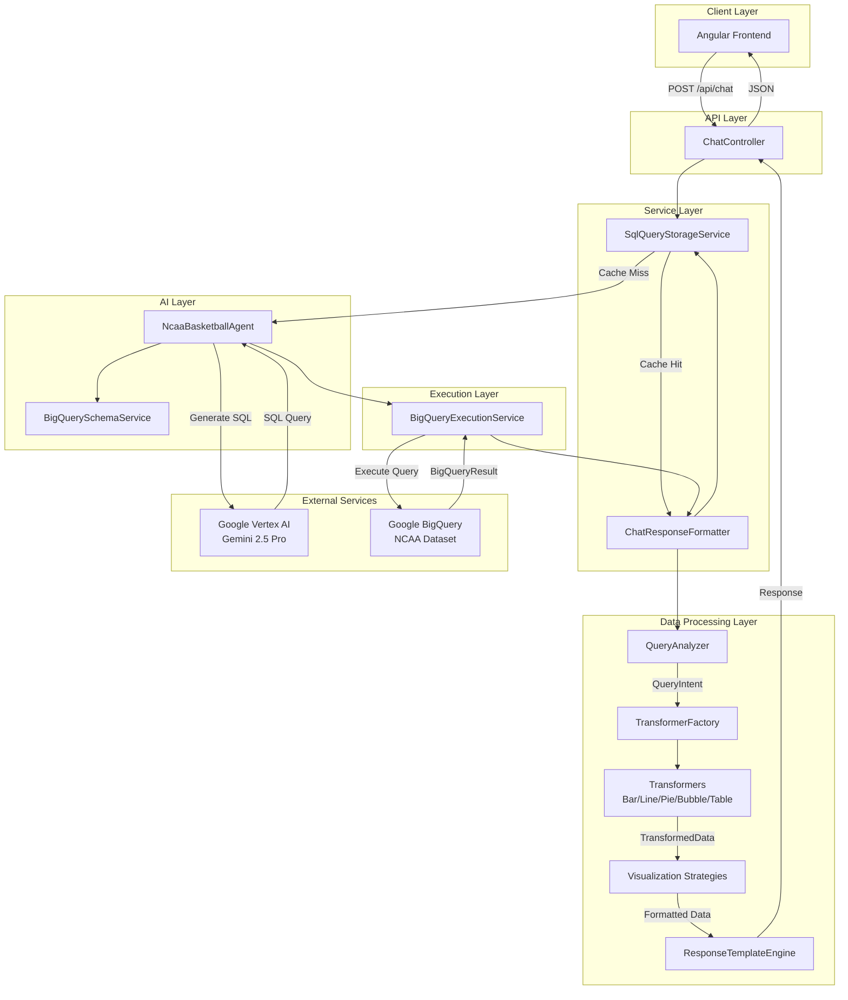
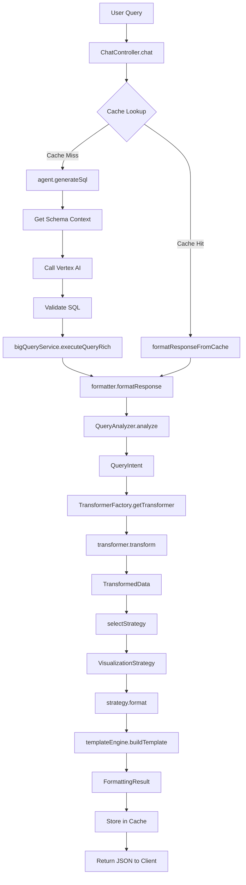

# RAG Chatbot Backend Architecture

## Overview

The **ragchatbot-be** is a Spring Boot 3.x application that serves as the intelligent backend for the NCAA Basketball Analytics chatbot. It orchestrates natural language processing, SQL generation, query execution, and intelligent visualization selection to deliver rich, contextual responses to user queries.

## Table of Contents

- [Architecture Overview](#architecture-overview)
- [Key Components](#key-components)
- [Design Patterns](#design-patterns)
- [Data Flow](#data-flow)
- [Technology Stack](#technology-stack)
- [Configuration](#configuration)
- [API Endpoints](#api-endpoints)
- [Adding New Features](#adding-new-features)
- [Testing](#testing)
- [Troubleshooting](#troubleshooting)

## Architecture Overview

### High-Level Architecture



### Layer Responsibilities

#### 1. API Layer (`controller`)
- **ChatController**: REST endpoint handler, request validation, response marshalling

#### 2. Service Layer (`service`)
- **ChatResponseFormatter**: Orchestrates visualization selection pipeline
- **SqlQueryStorageService**: Query caching, retrieval, and persistence

#### 3. AI Layer (`agent`, `service`)
- **NcaaBasketballAgent**: Vertex AI integration for SQL generation
- **BigQuerySchemaService**: Schema context management

#### 4. Data Processing Layer (`service/data`, `service/visualization`, `service/response`)
- **QueryAnalyzer**: Intent detection from queries and SQL patterns
- **TransformerFactory**: Selects appropriate data transformer
- **Transformers**: Convert BigQuery results to chart-optimized formats
- **Visualization Strategies**: Format data for specific chart types
- **ResponseTemplateEngine**: Generate natural language explanations

#### 5. Execution Layer (`service`)
- **BigQueryExecutionService**: Query execution and result handling

## Key Components

### 1. NcaaBasketballAgent

**Purpose**: Interfaces with Google Cloud Vertex AI to generate SQL from natural language.

**Key Responsibilities**:
- Initialize Vertex AI client with project/location configuration
- Build system prompts with schema context
- Generate SQL queries using Gemini 2.5 Pro model
- Validate SQL completeness and safety
- Handle errors and retries

**Code Location**: `com.example.ragchatbot.agent.NcaaBasketballAgent`

**Key Methods**:
```java
public String generateSql(String userQuery) throws IOException, InterruptedException
```

**Example Flow**:
```
User Query: "Show top 5 scorers in 2016"
    ↓
Schema Context + Prompt Engineering
    ↓
Vertex AI (Gemini 2.5 Pro)
    ↓
SQL: "SELECT full_name, AVG(points) as avg_points FROM ... WHERE season = 2016 GROUP BY full_name ORDER BY avg_points DESC LIMIT 5"
    ↓
Validation (completeness + safety)
    ↓
Return SQL
```

**Safety Validations**:
- Blocks: DROP, DELETE, UPDATE, INSERT, ALTER, TRUNCATE, CREATE
- Requires: SELECT or WITH to start
- Ensures: FROM clause presence in SELECT queries

### 2. BigQueryExecutionService

**Purpose**: Execute SQL queries against Google BigQuery and return structured results.

**Key Responsibilities**:
- Execute queries with timeout handling
- Parse BigQuery results into `BigQueryResult` objects
- Detect column types (numeric, categorical, temporal)
- Handle errors and empty results

**Code Location**: `com.example.ragchatbot.service.BigQueryExecutionService`

**Key Data Structure**:
```java
public class BigQueryResult {
    private List<String> columnNames;
    private List<String> columnTypes;
    private List<List<Object>> rows;
    private Set<String> numericColumns;
    // ... helper methods
}
```

### 3. ChatResponseFormatter

**Purpose**: Orchestrates the entire response formatting pipeline from raw data to visualization.

**Key Responsibilities**:
- Determine visualization intent from query and SQL
- Select appropriate data transformer
- Apply visualization strategy
- Generate natural language explanation
- Handle caching logic

**Code Location**: `com.example.ragchatbot.service.ChatResponseFormatter`

**Pipeline**:
```
BigQueryResult
    ↓
QueryAnalyzer.analyze() → QueryIntent
    ↓
TransformerFactory.getTransformer() → ResultTransformer
    ↓
Transformer.transform() → TransformedData
    ↓
selectStrategy() → VisualizationStrategy
    ↓
Strategy.format() → Map<String, Object>
    ↓
ResponseTemplateEngine.buildTemplate() → TemplateResult
    ↓
FormattingResult (with graphData or tableData)
```

### 4. QueryAnalyzer

**Purpose**: Analyze user queries and SQL to determine visualization intent.

**Key Responsibilities**:
- Detect query patterns (comparison, trend, distribution, correlation)
- Score confidence for each chart type
- Parse SQL for structural hints (GROUP BY, temporal columns, aggregations)
- Detect explicit chart requests ("show a bar chart...")

**Code Location**: `com.example.ragchatbot.service.visualization.QueryAnalyzer`

**Scoring Logic**:
- **Comparison**: Keywords like "top", "bottom", "compare", "rank"
- **Trend**: Keywords like "trend", "over time", "by season", temporal GROUP BY
- **Distribution**: Keywords like "breakdown", "percentage", "share"
- **Correlation**: Multiple numeric metrics with categorical dimension

**Output**:
```java
public class QueryIntent {
    private Map<String, Double> chartTypeScores;  // bar: 230.0, line: 100.0, ...
    private String primaryIntent;  // "comparison", "trend", "distribution", ...
    private boolean hasExplicitRequest;  // true if user said "show a line chart"
    private String explicitChartType;  // "line" if explicit
    private SqlAnalysisResult sqlAnalysis;  // Parsed SQL structure
}
```

### 5. Transformer Pipeline

**Purpose**: Convert raw BigQuery results into chart-specific data structures.

#### TransformerFactory

Selects the appropriate transformer based on:
- QueryIntent scores
- Data structure (row/column counts, types)
- Explicit user preferences

**Code Location**: `com.example.ragchatbot.service.data.transformer.TransformerFactory`

#### Available Transformers

##### LineChartTransformer
- **Use Case**: Single-series trends over time
- **Data Requirements**: Temporal column + numeric metric, 3-100 rows
- **Output**: `{ x: [...], y: [...], xLabel: "season", yLabel: "avg_points" }`

##### MultiLineChartTransformer (part of LineChartTransformer)
- **Use Case**: Multi-series temporal comparisons
- **Data Requirements**: Temporal column + category column + numeric metric
- **Output**: `{ series: [{name: "Team A", x: [...], y: [...]}, ...], xLabel: "season", yLabel: "avg_points" }`
- **Detection**: Identifies series columns by keywords: team, player, name, category

##### BarChartTransformer
- **Use Case**: Categorical comparisons, rankings
- **Data Requirements**: Categorical column + numeric metric, 2-50 rows
- **Output**: `{ x: ["Player 1", ...], y: [25.3, ...], labels: [...] }`

##### PieChartTransformer
- **Use Case**: Distribution, percentage breakdowns
- **Data Requirements**: Categorical column + positive metric, 3-12 categories
- **Output**: `{ labels: [...], values: [...] }`

##### BubbleChartTransformer
- **Use Case**: Multi-metric correlations
- **Data Requirements**: 1 categorical + 3 numeric columns
- **Output**: `{ x: [...], y: [...], sizes: [...], labels: [...] }`

##### TableTransformer
- **Use Case**: Complex data, detailed display, fallback
- **Data Requirements**: Any structure
- **Output**: `{ columns: [...], rows: [[...], [...]] }`

**Code Location**: `com.example.ragchatbot.service.data.transformer.*`

### 6. Visualization Strategy Pattern

**Purpose**: Format transformed data for frontend consumption based on chart type.

**Interface**:
```java
public interface VisualizationStrategy {
    boolean canHandle(TransformedData transformedData);
    Map<String, Object> format(TransformedData transformedData);
    int getPriority();
    String getChartType();
}
```

**Implementations**:
- `LineChartStrategy`: Handles `chartType="line"` with x/y arrays
- `MultiLineChartStrategy`: Handles `chartType="multi_line"` with series array
- `BarChartStrategy`: Handles `chartType="bar"` with x/y arrays
- `PieChartStrategy`: Handles `chartType="pie"` with labels/values
- `BubbleChartStrategy`: Handles `chartType="bubble"` with x/y/sizes
- `TableStrategy`: Fallback for any data

**Code Location**: `com.example.ragchatbot.service.visualization.*Strategy`

### 7. ResponseTemplateEngine

**Purpose**: Generate natural language explanations for visualizations.

**Key Responsibilities**:
- Create contextual headlines ("Trend of Average Points across Season")
- Generate insights from data (top values, min/max, trends)
- Format explanations based on chart type

**Code Location**: `com.example.ragchatbot.service.response.ResponseTemplateEngine`

**Example Templates**:
- **Trend**: "This line chart highlights how {metric} changes across {dimension} (min X, max Y)."
- **Comparison**: "Bars show how each {category} ranks based on {metric}. N rows total."
- **Distribution**: "Each slice represents the contribution of {metric} for every {category}."

### 8. SqlQueryStorageService

**Purpose**: Cache query results and maintain query history.

**Key Responsibilities**:
- Store queries with metadata in `logs/sql-queries.json`
- Implement cache lookup by query text
- Normalize SQL for signature-based matching
- Manage result truncation (max 100 rows stored)

**Code Location**: `com.example.ragchatbot.service.SqlQueryStorageService`

**Cache Structure**:
```json
{
  "query": "Show top 5 scorers in 2016",
  "sql": "SELECT full_name, AVG(points)...",
  "normalizedSql": "SELECT FULL_NAME, AVG(POINTS)...",
  "timestamp": "2025-11-16T10:30:00",
  "results": {
    "columns": ["full_name", "avg_points"],
    "columnTypes": ["STRING", "FLOAT64"],
    "rows": [["Player 1", 25.3], ...],
    "rowCount": 5
  },
  "analysis": {
    "intent": { ... },
    "selectedChartType": "bar",
    "resultStats": { ... }
  }
}
```

## Design Patterns

### 1. Strategy Pattern

**Usage**: Visualization selection and formatting

**Components**:
- `VisualizationStrategy` interface
- Multiple strategy implementations (LineChartStrategy, BarChartStrategy, etc.)
- `ChatResponseFormatter` as context that selects strategy

**Benefits**:
- Easy to add new chart types
- Runtime selection based on data characteristics
- Clean separation of formatting logic

**Example**:
```java
VisualizationStrategy strategy = selectStrategy(transformedData, targetChartType);
Map<String, Object> formattedData = strategy.format(transformedData);
```

### 2. Factory Pattern

**Usage**: Transformer creation

**Components**:
- `ResultTransformer` interface
- Multiple transformer implementations
- `TransformerFactory` creates appropriate transformer

**Benefits**:
- Centralized transformer selection logic
- Easy to extend with new transformers
- Priority-based selection

**Example**:
```java
ResultTransformer transformer = transformerFactory.getTransformer(result, intent, chartType);
TransformedData transformedData = transformer.transform(result);
```

### 3. Template Method Pattern

**Usage**: Response message generation

**Components**:
- `ResponseTemplateEngine` with chart-type-specific templates
- Common structure with customizable parts

**Benefits**:
- Consistent message format
- Reusable template logic
- Easy to customize per chart type

### 4. Builder Pattern

**Usage**: Complex object construction

**Components**:
- `QueryIntent` construction
- `BigQueryResult` creation from cached data

**Benefits**:
- Clear, readable object creation
- Flexible parameter combinations
- Immutable result objects

## Data Flow

### Complete Request Flow



### Detailed Processing Steps

1. **Request Reception**
   - `ChatController` receives POST to `/api/chat`
   - Validates query is non-empty
   - Extracts user query from request body

2. **Cache Lookup**
   - `SqlQueryStorageService` checks for exact query match
   - If found, retrieves cached results and skips SQL generation
   - If not found, proceeds to SQL generation

3. **SQL Generation** (Cache Miss)
   - `BigQuerySchemaService` loads table schema
   - `NcaaBasketballAgent` builds system prompt with schema context
   - Calls Vertex AI (Gemini 2.5 Pro) with prompt
   - Validates SQL completeness (starts with SELECT/WITH, has FROM)
   - Validates SQL safety (no DROP, DELETE, etc.)

4. **Query Execution**
   - `BigQueryExecutionService` executes SQL against BigQuery
   - Parses results into `BigQueryResult` object
   - Identifies column types (numeric, categorical, temporal)
   - Returns structured result with metadata

5. **Intent Analysis**
   - `QueryAnalyzer` analyzes user query text for keywords
   - Parses SQL for structural patterns (GROUP BY, temporal columns)
   - Scores confidence for each chart type
   - Detects explicit chart requests
   - Returns `QueryIntent` with scores and metadata

6. **Transformer Selection**
   - `TransformerFactory` evaluates available transformers
   - Checks `canTransform()` for each transformer in priority order
   - Considers explicit preferences if provided
   - Returns best-matching transformer

7. **Data Transformation**
   - Selected transformer converts `BigQueryResult` to `TransformedData`
   - Optimizes structure for target chart type
   - For multi-series: groups data by category column
   - For single-series: creates flat x/y arrays
   - Adds labels, axis names, and metadata

8. **Strategy Selection**
   - `ChatResponseFormatter` selects visualization strategy
   - Matches on `chartType` from `TransformedData`
   - Falls back to `TableStrategy` if no match

9. **Data Formatting**
   - Selected strategy formats data for frontend
   - Copies transformed data into final structure
   - Adds chart-specific metadata
   - Returns formatted map

10. **Template Generation**
    - `ResponseTemplateEngine` builds natural language message
    - Generates headline based on chart type
    - Creates explanation with data insights
    - Includes top values, min/max, trends

11. **Response Assembly**
    - Combines formatted data, message, and metadata
    - Wraps in `FormattingResult` object
    - Converts to JSON response map
    - Adds `fromCache` flag

12. **Cache Storage**
    - `SqlQueryStorageService` stores complete response
    - Saves to `logs/sql-queries.json`
    - Includes query, SQL, results, and analysis
    - Enables future cache hits

13. **Response Return**
    - `ChatController` returns JSON to client
    - Includes `message`, `graphData` or `tableData`
    - Frontend renders appropriate component

## Technology Stack

### Core Framework
- **Spring Boot 3.x**: Application framework
- **Spring Web**: REST API support
- **Spring DI**: Dependency injection

### AI & Data
- **Google Cloud Vertex AI SDK**: Gemini 2.5 Pro integration
- **Google Cloud BigQuery SDK**: Query execution
- **Jackson**: JSON serialization/deserialization

### Build & Testing
- **Gradle 8.5**: Build automation
- **JUnit 5**: Unit testing framework
- **AssertJ**: Fluent assertions
- **Mockito**: Mocking framework

### Logging & Monitoring
- **SLF4J + Logback**: Structured logging
- **MDC**: Request tracing with request IDs

### Language & Runtime
- **Java 17+**: Language version
- **JVM**: Runtime environment

## Configuration

### Environment Variables Setup

**IMPORTANT**: Never commit `.env` files or sensitive credentials to version control.

#### Local Development Setup

1. **Copy the example environment file**:
   ```bash
   cd ragchatbot-be
   cp .env.example .env
   ```

2. **Edit `.env` and fill in your values**:
   ```env
   GCP_PROJECT_ID=your-actual-gcp-project-id
   GCP_VERTEX_AI_LOCATION=us-central1
   GCP_VERTEX_AI_MODEL=gemini-2.5-pro
   GCP_BIGQUERY_DATASET=bigquery-public-data
   GCP_BIGQUERY_SCHEMA=ncaa_basketball
   CORS_ALLOWED_ORIGINS=http://localhost:4200
   ```

3. **Export environment variables** (or use a .env loader):
   ```bash
   export $(cat .env | xargs)
   ```

#### Required Environment Variables

| Variable | Required | Default | Description |
|----------|----------|---------|-------------|
| `GCP_PROJECT_ID` | **Yes** | None | Your Google Cloud Project ID |
| `GCP_VERTEX_AI_LOCATION` | No | `us-central1` | Vertex AI region |
| `GCP_VERTEX_AI_MODEL` | No | `gemini-2.5-pro` | Model name for SQL generation |
| `GCP_BIGQUERY_DATASET` | No | `bigquery-public-data` | BigQuery dataset name |
| `GCP_BIGQUERY_SCHEMA` | No | `ncaa_basketball` | BigQuery schema name |
| `CORS_ALLOWED_ORIGINS` | No | `http://localhost:4200` | Allowed CORS origins |

### Application Properties

**File**: `src/main/resources/application.properties`

The application properties file uses environment variable interpolation:

```properties
# Application
spring.application.name=ragchatbot-be
server.port=8080

# GCP Configuration - Uses environment variables
gcp.project-id=${GCP_PROJECT_ID}
gcp.bigquery.dataset=${GCP_BIGQUERY_DATASET:bigquery-public-data}
gcp.bigquery.schema=${GCP_BIGQUERY_SCHEMA:ncaa_basketball}

# Vertex AI Configuration - Uses environment variables
gcp.vertexai.location=${GCP_VERTEX_AI_LOCATION:us-central1}
gcp.vertexai.model=${GCP_VERTEX_AI_MODEL:gemini-2.5-pro}

# CORS Configuration - Uses environment variables
spring.web.cors.allowed-origins=${CORS_ALLOWED_ORIGINS:http://localhost:4200}
```

**Syntax**: `${ENV_VAR:default_value}` - Uses environment variable or falls back to default.

### GCP Credentials

The application uses **Application Default Credentials** (ADC):

1. **Local Development**:
   ```bash
   gcloud auth application-default login
   ```

2. **Production (GKE)**:
   - Use Workload Identity
   - Attach service account with roles:
     - `roles/aiplatform.user` (Vertex AI)
     - `roles/bigquery.dataViewer` (BigQuery read)
     - `roles/bigquery.jobUser` (BigQuery jobs)

### Production Deployment

#### Kubernetes Secrets

Create a Kubernetes secret for sensitive values:

```bash
kubectl create secret generic ragchatbot-secrets \
  --from-literal=gcp-project-id=your-project-id
```

Update `k8s/deployment.yaml` to inject environment variables:

```yaml
env:
  - name: GCP_PROJECT_ID
    valueFrom:
      secretKeyRef:
        name: ragchatbot-secrets
        key: gcp-project-id
  - name: GCP_VERTEX_AI_LOCATION
    value: "us-central1"
  - name: GCP_VERTEX_AI_MODEL
    value: "gemini-2.5-pro"
```

#### Docker Environment

Pass environment variables when running Docker:

```bash
docker run -e GCP_PROJECT_ID=your-project-id \
           -e GCP_VERTEX_AI_LOCATION=us-central1 \
           ragchatbot-be:latest
```

Or use an env file:

```bash
docker run --env-file .env ragchatbot-be:latest
```

## API Endpoints

### POST /api/chat

**Purpose**: Process natural language query and return formatted response

**Request**:
```json
{
  "query": "Show top 5 scorers in 2016 season"
}
```

**Response** (Bar Chart):
```json
{
  "message": "Comparing Avg Points by Full Name\n\nBars show how each Full Name ranks based on Avg Points. 5 rows total.",
  "graphData": {
    "chartType": "bar",
    "x": ["Player 1", "Player 2", "Player 3", "Player 4", "Player 5"],
    "y": [25.3, 24.8, 23.5, 22.1, 21.9],
    "labels": ["...", "...", "...", "...", "..."],
    "xLabel": "full_name",
    "yLabel": "avg_points"
  },
  "fromCache": false
}
```

**Response** (Multi-Line Chart):
```json
{
  "message": "Trend of Avg Points Per Game across Season\n\nThis line chart highlights how Avg Points Per Game changes across Season (min 64.0, max 86.4).",
  "graphData": {
    "chartType": "multi_line",
    "series": [
      {
        "name": "Team A",
        "x": [2013, 2014, 2015, 2016, 2017],
        "y": [71.5, 75.2, 78.1, 82.3, 79.8],
        "labels": ["...", "...", "...", "...", "..."]
      },
      {
        "name": "Team B",
        "x": [2013, 2014, 2015, 2016, 2017],
        "y": [69.2, 72.4, 76.5, 80.1, 83.2],
        "labels": ["...", "...", "...", "...", "..."]
      }
    ],
    "xLabel": "season",
    "yLabel": "avg_points_per_game"
  },
  "fromCache": false
}
```

**Error Response**:
```json
{
  "message": "Error processing query: Invalid SQL generated"
}
```

### POST /api/queries/process

**Purpose**: Reprocess and update cached query results (admin endpoint)

**Response**:
```json
{
  "originalCount": 150,
  "duplicatesRemoved": 20,
  "finalCount": 130,
  "queriesProcessed": 130,
  "queriesSucceeded": 125,
  "queriesFailed": 5,
  "processingTimeMs": 45000,
  "errors": ["Error messages..."]
}
```

## Adding New Features

### Adding a New Chart Type

#### 1. Create Transformer

**File**: `src/main/java/com/example/ragchatbot/service/data/transformer/MyChartTransformer.java`

```java
@Component
public class MyChartTransformer implements ResultTransformer {
    
    @Override
    public boolean canTransform(BigQueryResult result, QueryIntent intent) {
        // Check if data structure supports this chart
        return intent.getScore("mychart") > 1.5 
            && result.getColumnCount() >= 2
            && result.getRowCount() >= 5;
    }
    
    @Override
    public TransformedData transform(BigQueryResult result) {
        TransformedData transformedData = new TransformedData("mychart");
        
        // Extract and structure data
        // ... transformation logic ...
        
        transformedData.put("x", xData);
        transformedData.put("y", yData);
        transformedData.put("xLabel", xLabel);
        transformedData.put("yLabel", yLabel);
        
        return transformedData;
    }
    
    @Override
    public String getTargetChartType() {
        return "mychart";
    }
    
    @Override
    public int getPriority() {
        return 35; // Medium-high priority
    }
}
```

#### 2. Create Strategy

**File**: `src/main/java/com/example/ragchatbot/service/visualization/MyChartStrategy.java`

```java
@Component
public class MyChartStrategy implements VisualizationStrategy {
    
    @Override
    public boolean canHandle(TransformedData transformedData) {
        return "mychart".equals(transformedData.getChartType())
            && transformedData.containsKey("x")
            && transformedData.containsKey("y");
    }
    
    @Override
    public Map<String, Object> format(TransformedData transformedData) {
        Map<String, Object> graphData = new HashMap<>();
        graphData.putAll(transformedData.getData());
        graphData.put("chartType", "mychart");
        return graphData;
    }
    
    @Override
    public int getPriority() {
        return 35;
    }
    
    @Override
    public String getChartType() {
        return "mychart";
    }
}
```

#### 3. Update Template Engine

**File**: `src/main/java/com/example/ragchatbot/service/response/ResponseTemplateEngine.java`

```java
public TemplateResult buildTemplate(String userQuery, String chartType, 
                                    QueryIntent intent, ResultStatsSummary stats) {
    return switch (chartType) {
        case "line" -> buildTrendTemplate(intent, stats);
        case "bar" -> buildComparisonTemplate(intent, stats);
        case "mychart" -> buildMyChartTemplate(intent, stats);  // Add this
        default -> buildTableTemplate(stats);
    };
}

private TemplateResult buildMyChartTemplate(QueryIntent intent, ResultStatsSummary stats) {
    String headline = "Custom visualization of " + stats.getPrimaryMetric();
    String explanation = "This chart shows...";
    return new TemplateResult("mychart_template", "mychart", headline, explanation, 
                            new ArrayList<>(), intent.getPrimaryIntent());
}
```

#### 4. Update Query Analyzer (Optional)

**File**: `src/main/java/com/example/ragchatbot/service/visualization/QueryAnalyzer.java`

Add keywords and scoring logic for the new chart type in the `analyze` method.

#### 5. Write Tests

**File**: `src/test/java/com/example/ragchatbot/service/data/transformer/MyChartTransformerTest.java`

```java
@Test
void transformsDataCorrectly() {
    BigQueryResult result = BigQueryResult.fromCachedData(
        List.of("category", "value"),
        List.of("STRING", "FLOAT64"),
        List.of(
            List.of("A", 10.5),
            List.of("B", 15.2)
        )
    );
    
    MyChartTransformer transformer = new MyChartTransformer();
    TransformedData transformed = transformer.transform(result);
    
    assertThat(transformed.getChartType()).isEqualTo("mychart");
    assertThat(transformed.get("x")).asList().hasSize(2);
}
```

### Adding Query Pattern Recognition

Update `QueryAnalyzer` to detect new patterns:

```java
// In QueryAnalyzer.analyzeQueryText()
if (lowerQuery.contains("show distribution") || lowerQuery.contains("breakdown")) {
    scores.merge("distribution", 2.0, Double::sum);
}
```

### Customizing SQL Generation

Update `NcaaBasketballAgent.buildSystemPrompt()` to add new rules:

```java
private String buildSystemPrompt(String schemaContext) {
    return "You are a BigQuery SQL expert...\n\n"
        + "NEW RULE: For geographic queries, include location columns\n"
        + "EXAMPLE: SELECT venue_city, COUNT(*) as games...";
}
```

## Testing

### Run All Tests
```bash
./gradlew test
```

### Run Specific Test Class
```bash
./gradlew test --tests ChatResponseFormatterTest
```

### Test Coverage
```bash
./gradlew test jacocoTestReport
# Report: build/reports/jacoco/test/html/index.html
```

### Key Test Classes

- `ChatResponseFormatterTest`: End-to-end formatting pipeline
- `LineChartTransformerTest`: Line chart data transformation
- `QueryAnalyzerTest`: Intent detection and scoring
- `ResultStatsCollectorTest`: Statistical analysis

### Example Test

```java
@Test
void honorsExplicitLineChartRequest() {
    BigQueryResult result = BigQueryResult.fromCachedData(
        List.of("season", "avg_points"),
        List.of("INT64", "FLOAT64"),
        List.of(List.of(2013, 75.5), List.of(2014, 78.2))
    );
    
    when(queryAnalyzer.analyze(anyString(), any(), any()))
        .thenReturn(new QueryIntent(
            Map.of("line", 230.0, "bar", 100.0),
            "trend",
            true,  // explicit request
            "line",
            null,
            1.0
        ));
    
    FormattingResult result = formatter.formatResponse(
        "Show a line chart of average points by season",
        "SELECT ...",
        result
    );
    
    assertThat(result.getSelectedChartType()).isEqualTo("line");
    assertThat(result.getResponseBody()).containsKey("graphData");
}
```

## Troubleshooting

### Common Issues

#### 1. Vertex AI Authentication Errors

**Error**: `Failed to initialize Vertex AI client`

**Solutions**:
- Run `gcloud auth application-default login`
- Verify `gcp.project-id` in `application.properties`
- Check service account has `roles/aiplatform.user`

#### 2. BigQuery Permission Denied

**Error**: `Access Denied: BigQuery BigQuery: Permission denied`

**Solutions**:
- Add `roles/bigquery.dataViewer` to service account
- Add `roles/bigquery.jobUser` to service account
- Verify `gcp.bigquery.dataset` and `gcp.bigquery.schema` are correct

#### 3. SQL Generation Returns Invalid SQL

**Error**: `Generated SQL is incomplete`

**Solutions**:
- Check system prompt in `NcaaBasketballAgent`
- Verify schema context is loading correctly
- Try more specific user query
- Check Vertex AI model version

#### 4. Wrong Visualization Selected

**Issue**: Query asks for bar chart but returns table

**Solutions**:
- Check `QueryAnalyzer` scoring logic
- Verify transformer `canTransform()` conditions
- Check data structure (row/column counts)
- Review intent scores in logs

#### 5. Cache Not Working

**Issue**: Same query always hits Vertex AI

**Solutions**:
- Check `logs/sql-queries.json` exists and is writable
- Verify query text matches exactly (case-sensitive)
- Check `SqlQueryStorageService` is enabled
- Review cache lookup logs

### Debugging Tips

#### Enable Debug Logging

**File**: `src/main/resources/logback-spring.xml`

```xml
<logger name="com.example.ragchatbot" level="DEBUG" />
```

#### Trace Request Flow

Look for request ID in logs:
```
grep "requestId=abc-123" logs/ragchatbot.log
```

#### Inspect Cached Queries

```bash
cat logs/sql-queries.json | jq '.[] | select(.query | contains("top 5"))'
```

#### Test SQL Directly

```bash
bq query --use_legacy_sql=false 'SELECT full_name, AVG(points) as avg_points FROM `bigquery-public-data.ncaa_basketball.mbb_players_games_sr` WHERE season = 2016 GROUP BY full_name ORDER BY avg_points DESC LIMIT 5'
```

## Performance Considerations

### Query Caching
- First query: ~10-15s (Vertex AI + BigQuery)
- Cached query: ~50-200ms

### Optimization Strategies
1. **Cache warming**: Pre-populate common queries
2. **Connection pooling**: BigQuery client reuse
3. **Async processing**: Consider CompletableFuture for independent operations
4. **Result pagination**: Limit row counts in SQL (already implemented)

### Monitoring Metrics
- SQL generation time
- BigQuery execution time
- Formatting time
- Cache hit rate

---

**For more information**, see the [main organization README](./profile/README.md) and [frontend documentation](./ragchatbot-fe.md).

