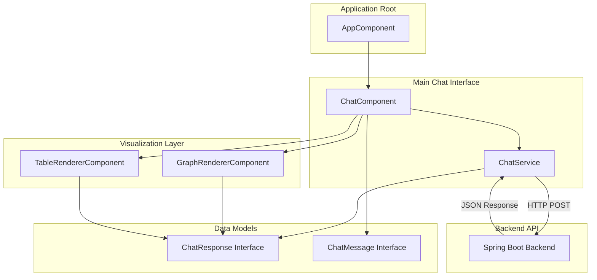
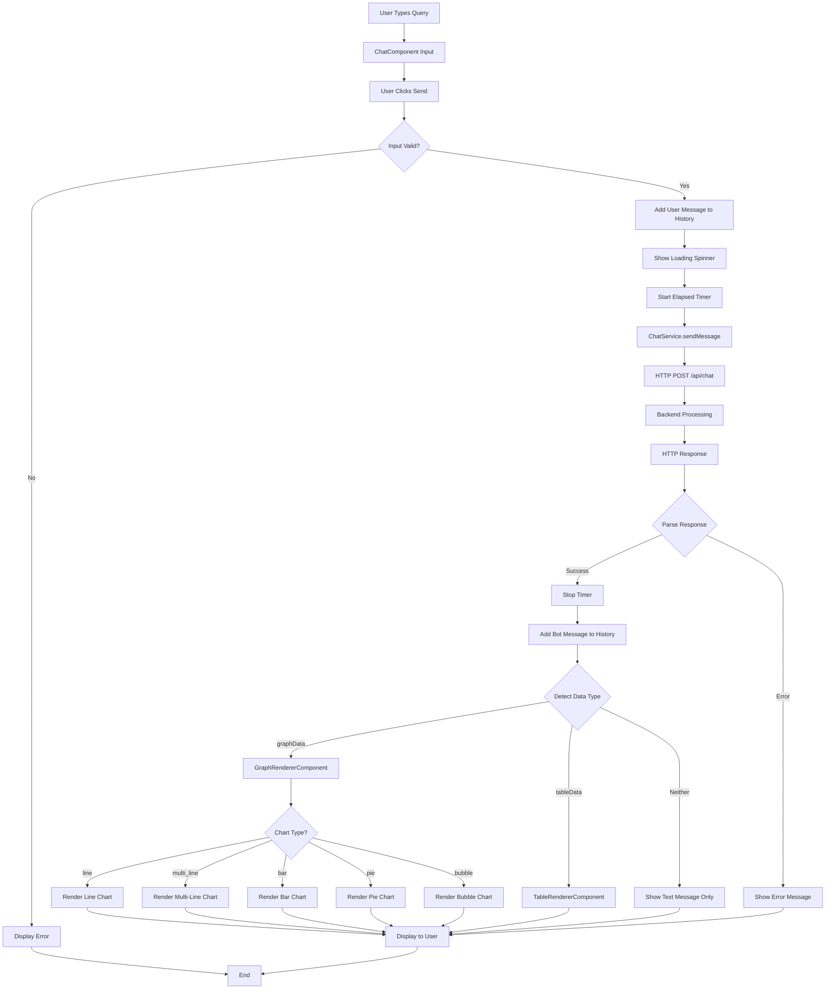
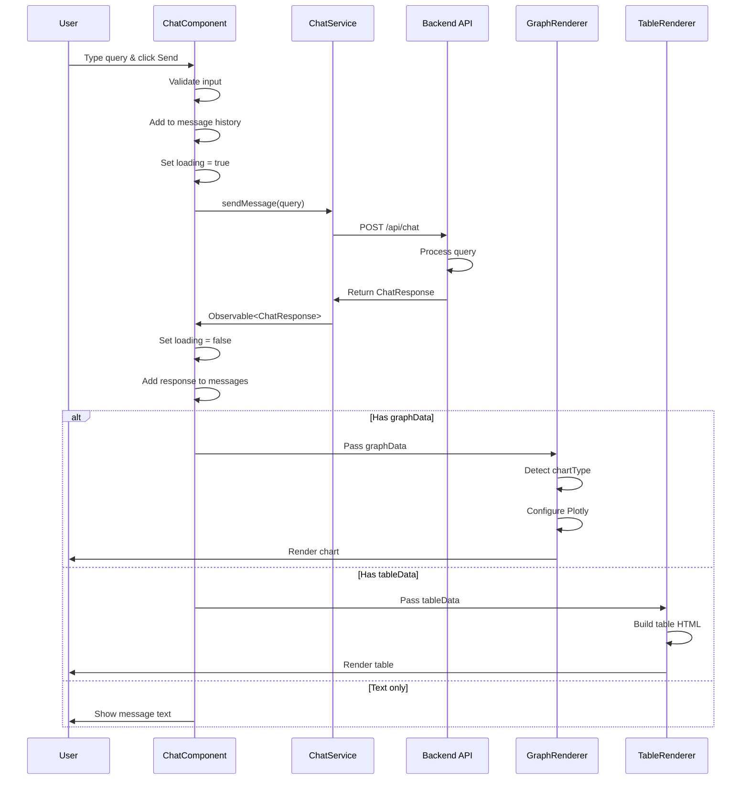

# RAG Chatbot Frontend Architecture

## Overview

The **ragchatbot-fe** is a modern Angular 18+ application that provides an intuitive, conversational interface for querying NCAA basketball data. Built with standalone components and featuring a beautiful glass-morphism design, it delivers interactive visualizations powered by Plotly.js.

## Table of Contents

- [Architecture Overview](#architecture-overview)
- [Key Components](#key-components)
- [Design Patterns](#design-patterns)
- [Data Flow](#data-flow)
- [Visualization Support](#visualization-support)
- [Technology Stack](#technology-stack)
- [Styling and Theming](#styling-and-theming)
- [Configuration](#configuration)
- [Adding New Features](#adding-new-features)
- [Testing](#testing)
- [Troubleshooting](#troubleshooting)

## Architecture Overview

### High-Level Component Structure



### Application Structure

```
src/
├── app/
│   ├── app.component.ts              # Root component
│   ├── components/
│   │   ├── chat/
│   │   │   └── chat.component.ts     # Main chat interface
│   │   ├── graph-renderer/
│   │   │   └── graph-renderer.component.ts  # Plotly visualizations
│   │   └── table-renderer/
│   │       └── table-renderer.component.ts  # Tabular data display
│   ├── models/
│   │   └── chat-response.model.ts    # Type definitions
│   ├── services/
│   │   └── chat.service.ts           # API communication
│   └── config/
│       └── feature-flags.ts          # Feature toggles
├── styles.css                         # Global styles
├── main.ts                           # Application bootstrap
└── types/
    └── plotly.js-dist-min.d.ts      # Plotly type declarations
```

## Key Components

### 1. ChatComponent

**Purpose**: Main conversational interface that manages message history, user input, and conditional rendering.

**Location**: `src/app/components/chat/chat.component.ts`

**Key Responsibilities**:
- Display conversation history
- Handle user input with multi-line textarea
- Send queries to backend via ChatService
- Conditionally render GraphRenderer or TableRenderer
- Manage query history with arrow key navigation
- Show loading states with elapsed time counter
- Auto-scroll to latest messages

**Key Features**:
- **Message History**: Displays all user queries and bot responses
- **Auto-resizing Textarea**: Expands with content up to 30% viewport height
- **Query History**: Navigate previous queries with ↑/↓ arrow keys
- **Loading Indicator**: Animated spinner with real-time elapsed time
- **Time Display**: Shows query execution time for each response
- **Responsive Design**: Adapts to mobile, tablet, and desktop

**Template Structure**:
```html
<div class="chat-container">
  <div class="chat-header">NCAA Basketball Data</div>
  
  <div class="chat-messages">
    <div *ngFor="let message of messages" class="message">
      <!-- User query or bot response -->
      <div *ngIf="message.response">
        <!-- Message text -->
        <!-- Table renderer (if tableData) -->
        <!-- Graph renderer (if graphData) -->
      </div>
    </div>
    <!-- Loading spinner -->
  </div>
  
  <div class="history-panel" *ngIf="showHistory">
    <!-- Query history list -->
  </div>
  
  <div class="chat-input-container">
    <textarea [(ngModel)]="inputMessage"></textarea>
    <button (click)="sendMessage()">Send</button>
  </div>
</div>
```

**State Management**:
```typescript
messages: ChatMessage[] = [];           // Conversation history
inputMessage: string = '';              // Current input
loading: boolean = false;               // Loading state
queryHistory: string[] = [];            // Previous queries
historyIndex: number | null = null;     // History navigation
elapsedTime: number = 0;               // Current query duration
```

**Key Methods**:
```typescript
sendMessage(): void                     // Send query to backend
onInputKeyDown(event: KeyboardEvent)   // Handle Enter and arrow keys
formatTime(milliseconds: number)       // Format duration display
autoResizeTextarea()                   // Expand textarea dynamically
```

### 2. GraphRendererComponent

**Purpose**: Render interactive Plotly.js visualizations based on chart type and data structure.

**Location**: `src/app/components/graph-renderer/graph-renderer.component.ts`

**Key Responsibilities**:
- Detect chart type from `graphData.chartType`
- Configure Plotly layout and traces
- Render bar, line, multi_line, pie, bubble, and scatter charts
- Apply glass-morphism styling
- Handle window resize for responsiveness
- Format axis labels for readability

**Supported Chart Types**:

#### Bar Chart
```typescript
{
  chartType: 'bar',
  x: ['Player 1', 'Player 2', 'Player 3'],
  y: [25.3, 24.8, 23.5],
  labels: ['Player 1: 25.3 points', ...],
  xLabel: 'player_name',
  yLabel: 'avg_points'
}
```

#### Line Chart (Single Series)
```typescript
{
  chartType: 'line',
  x: [2013, 2014, 2015, 2016, 2017],
  y: [71.5, 75.2, 78.1, 82.3, 79.8],
  labels: ['Season 2013: 71.5', ...],
  xLabel: 'season',
  yLabel: 'avg_points'
}
```

#### Multi-Line Chart (Multiple Series)
```typescript
{
  chartType: 'multi_line',
  series: [
    {
      name: 'Team A',
      x: [2013, 2014, 2015, 2016, 2017],
      y: [71.5, 75.2, 78.1, 82.3, 79.8],
      labels: ['2013-Team A: 71.5', ...]
    },
    {
      name: 'Team B',
      x: [2013, 2014, 2015, 2016, 2017],
      y: [69.2, 72.4, 76.5, 80.1, 83.2],
      labels: ['2013-Team B: 69.2', ...]
    }
  ],
  xLabel: 'season',
  yLabel: 'avg_points_per_game'
}
```

#### Pie Chart
```typescript
{
  chartType: 'pie',
  labels: ['Category A', 'Category B', 'Category C'],
  values: [45.2, 32.8, 22.0],
  yLabel: 'percentage'
}
```

#### Bubble Chart
```typescript
{
  chartType: 'bubble',
  x: [23.5, 25.1, 21.3],
  y: [8.2, 9.5, 7.8],
  sizes: [10, 15, 8],
  labels: ['Player 1', 'Player 2', 'Player 3'],
  xLabel: 'avg_points',
  yLabel: 'avg_rebounds'
}
```

**Rendering Pipeline**:
```typescript
ngOnInit() → renderPlot()
    ↓
Detect chartType
    ↓
Configure Plotly layout
    ↓
Build data traces
    ↓
Apply styling (colors, shapes, legends)
    ↓
Plotly.newPlot()
    ↓
Add resize handler
```

**Color Palette** (Multi-Series):
```typescript
const palette = [
  'rgba(255, 107, 53, 1)',     // Primary orange
  'rgba(78, 205, 196, 1)',     // Teal
  'rgba(142, 68, 173, 1)',     // Purple
  'rgba(52, 152, 219, 1)',     // Blue
  'rgba(46, 204, 113, 1)',     // Green
  'rgba(241, 196, 15, 1)'      // Yellow
];
```

**Key Styling Features**:
- Smooth line rendering with linear shape (no curves)
- Gradient bar colors (orange spectrum)
- Hover templates with formatted labels
- Responsive layout with automatic resizing
- Glass-morphism background integration

### 3. TableRendererComponent

**Purpose**: Display tabular data with modern styling and scrollable overflow.

**Location**: `src/app/components/table-renderer/table-renderer.component.ts`

**Key Responsibilities**:
- Render HTML table from columns and rows
- Apply glass-morphism styling
- Handle overflow with scrollbars
- Responsive column sizing

**Data Structure**:
```typescript
{
  columns: ['player_name', 'season', 'avg_points'],
  rows: [
    ['Player 1', 2016, 25.3],
    ['Player 2', 2016, 24.8],
    ['Player 3', 2016, 23.5]
  ]
}
```

**Template**:
```html
<div class="table-container">
  <table class="data-table">
    <thead>
      <tr>
        <th *ngFor="let col of tableData.columns">{{ col }}</th>
      </tr>
    </thead>
    <tbody>
      <tr *ngFor="let row of tableData.rows">
        <td *ngFor="let cell of row">{{ cell }}</td>
      </tr>
    </tbody>
  </table>
</div>
```

**Styling Features**:
- Sticky header on scroll
- Hover effects on rows
- Custom scrollbars matching theme
- Maximum height with overflow
- Zebra striping (subtle)

### 4. ChatService

**Purpose**: Handle HTTP communication with the backend API.

**Location**: `src/app/services/chat.service.ts`

**Key Responsibilities**:
- Send POST requests to `/api/chat`
- Return Observable<ChatResponse>
- Handle HTTP errors
- Process batch queries (admin feature)

**Methods**:
```typescript
sendMessage(query: string): Observable<ChatResponse>
processQueries(): Observable<ProcessQueriesResponse>
```

**Example Usage**:
```typescript
this.chatService.sendMessage('Show top 5 scorers').subscribe({
  next: (response: ChatResponse) => {
    // Add to messages
    this.messages.push({
      text: query,
      isUser: false,
      response: response,
      timeTaken: Date.now() - startTime
    });
  },
  error: (error) => {
    // Show error message
    this.messages.push({
      text: 'Error: ' + error.message,
      isUser: false
    });
  }
});
```

## Design Patterns

### 1. Component-Based Architecture

**Pattern**: Modular, reusable Angular standalone components

**Components**:
- `ChatComponent`: Container component
- `GraphRendererComponent`: Presentation component
- `TableRendererComponent`: Presentation component

**Benefits**:
- Clear separation of concerns
- Reusable visualization components
- Easy to test in isolation
- Self-contained with dependencies

### 2. Observable Pattern (RxJS)

**Pattern**: Reactive programming for async operations

**Usage**:
```typescript
this.chatService.sendMessage(query)
  .pipe(
    // Optional operators: map, catchError, retry, etc.
  )
  .subscribe({
    next: (response) => { /* Handle success */ },
    error: (error) => { /* Handle error */ }
  });
```

**Benefits**:
- Non-blocking async operations
- Easy error handling
- Composable with RxJS operators
- Automatic subscription cleanup

### 3. Type Safety with Interfaces

**Pattern**: Strongly typed models for all data structures

**Interfaces**:
```typescript
export interface ChatResponse {
  message: string;
  tableData?: TableData;
  graphData?: GraphData;
}

export interface ChatMessage {
  text: string;
  isUser: boolean;
  response?: ChatResponse;
  timeTaken?: number;
}
```

**Benefits**:
- Compile-time type checking
- IntelliSense support
- Self-documenting code
- Prevents runtime errors

### 4. Feature Flag Configuration

**Pattern**: Centralized feature toggles for experimental features

**File**: `src/app/config/feature-flags.ts`
```typescript
export const featureFlags = {
  showProcessQueriesButton: false,
  enableChatHistoryPanel: true
};
```

**Usage**:
```typescript
import { featureFlags } from '../../config/feature-flags';

showProcessQueriesButton = featureFlags.showProcessQueriesButton;
```

**Benefits**:
- Easy to enable/disable features
- No code changes needed
- Gradual rollout support

## Data Flow

### Complete User Interaction Flow



### Detailed Component Communication



## Visualization Support

### Chart Type Matrix

| Chart Type | Use Case | Data Requirements | Frontend Component |
|------------|----------|-------------------|-------------------|
| `line` | Single-series trends | Temporal x + numeric y | GraphRenderer (line path) |
| `multi_line` | Multi-series comparisons | Temporal x + category + numeric y | GraphRenderer (series path) |
| `bar` | Categorical comparisons | Categorical x + numeric y | GraphRenderer (bar path) |
| `pie` | Distribution breakdown | Categories + positive values | GraphRenderer (pie path) |
| `bubble` | Multi-metric correlation | Numeric x + numeric y + sizes | GraphRenderer (bubble path) |
| `table` | Detailed data display | Any structure | TableRenderer |

### Chart Rendering Details

#### Line Charts (Single Series)
```typescript
// Detection
if (chartType === 'line' && !hasSeries)

// Plotly Configuration
{
  type: 'scatter',
  mode: 'lines+markers',
  line: { 
    color: 'rgba(255, 107, 53, 1)',
    width: 3,
    shape: 'linear'  // Straight lines, no curves
  },
  marker: { 
    size: 8,
    color: 'rgba(255, 107, 53, 1)'
  }
}
```

#### Multi-Line Charts (Multiple Series)
```typescript
// Detection
if ((chartType === 'line' || chartType === 'multi_line') && hasSeries)

// Plotly Configuration (per series)
{
  type: 'scatter',
  mode: 'lines+markers',
  name: series.name,  // Shows in legend
  line: { 
    color: palette[idx],
    width: 3,
    shape: 'linear'
  },
  marker: { 
    size: 7,
    color: palette[idx]
  }
}

// Layout
{
  showlegend: true,
  legend: { ... }
}
```

#### Bar Charts
```typescript
// Plotly Configuration
{
  type: 'bar',
  marker: {
    color: gradientColors,  // Orange gradient per bar
    line: { width: 1.5 }
  }
}
```

#### Pie Charts
```typescript
// Plotly Configuration
{
  type: 'pie',
  labels: [...],
  values: [...],
  marker: {
    colors: colorPalette,  // Different color per slice
    line: { color: 'white', width: 2 }
  }
}
```

### Responsive Chart Behavior

**Desktop** (>1200px):
- Chart height: 450px
- Full feature set
- Hover tooltips

**Tablet** (768px - 1200px):
- Chart height: 400px
- Responsive mode bar
- Touch-optimized

**Mobile** (<768px):
- Chart height: 300px
- Simplified controls
- Pinch-to-zoom

## Technology Stack

### Core Framework
- **Angular 18+**: Component framework
- **TypeScript 5+**: Type-safe JavaScript
- **RxJS 7+**: Reactive programming

### Visualization
- **Plotly.js**: Interactive charting library
  - Line charts with multi-series support
  - Bar charts with gradients
  - Pie charts with percentages
  - Bubble charts for correlations
  - Responsive and interactive

### Build Tools
- **Angular CLI**: Project scaffolding and build
- **Webpack** (via Angular): Module bundling
- **TypeScript Compiler**: Type checking and transpilation

### Development Tools
- **npm/bun**: Package management
- **Angular DevTools**: Debugging
- **Chrome DevTools**: Browser debugging

### HTTP Communication
- **HttpClient**: Angular's HTTP service
- **Proxy Configuration**: API routing during development

## Styling and Theming

### Glass-Morphism Design

**Core Principle**: Frosted glass effect with transparency, blur, and subtle shadows

**CSS Variables** (`styles.css`):
```css
:root {
  /* Colors */
  --primary-gradient-start: #ff6b35;
  --primary-gradient-end: #f7931e;
  --text-primary: #1f2937;
  --text-secondary: #6b7280;
  --text-white: #ffffff;
  
  /* Glass Effect */
  --glass-bg: rgba(255, 255, 255, 0.7);
  --glass-blur: blur(10px);
  --glass-border: rgba(255, 255, 255, 0.3);
  --glass-shadow: 0 8px 32px rgba(0, 0, 0, 0.1);
  
  /* Spacing */
  --spacing-xs: 4px;
  --spacing-sm: 8px;
  --spacing-md: 16px;
  --spacing-lg: 24px;
  --spacing-xl: 32px;
  
  /* Border Radius */
  --radius-sm: 4px;
  --radius-md: 8px;
  --radius-lg: 12px;
  --radius-xl: 16px;
  
  /* Transitions */
  --transition-fast: 0.15s ease;
  --transition-normal: 0.3s ease;
}
```

### Component-Specific Styling

#### Chat Container
```css
.message-content {
  background: var(--glass-bg);
  backdrop-filter: var(--glass-blur);
  border: 1px solid var(--glass-border);
  box-shadow: var(--glass-shadow);
  border-radius: var(--radius-lg);
  transition: transform var(--transition-fast);
}

.message-content:hover {
  transform: translateY(-2px);
}
```

#### User Messages
```css
.user-message .message-content {
  background: linear-gradient(135deg, 
    var(--primary-gradient-start), 
    var(--primary-gradient-end));
  color: var(--text-white);
}
```

#### Input Field
```css
.chat-input {
  background: rgba(255, 255, 255, 0.9);
  backdrop-filter: blur(5px);
  border: 1px solid var(--glass-border);
  border-radius: var(--radius-xl);
}

.chat-input:focus {
  border-color: var(--primary-gradient-start);
  box-shadow: 0 0 0 3px rgba(255, 107, 53, 0.1);
}
```

### Animations

```css
@keyframes fadeInUp {
  from {
    opacity: 0;
    transform: translateY(20px);
  }
  to {
    opacity: 1;
    transform: translateY(0);
  }
}

@keyframes spin {
  from { transform: rotate(0deg); }
  to { transform: rotate(360deg); }
}
```

### Responsive Breakpoints

```css
/* Mobile */
@media (max-width: 768px) {
  .chat-header h1 { font-size: 22px; }
  .message-content { max-width: 85%; }
}

/* Desktop */
@media (min-width: 1200px) {
  .plot-container { height: 450px; }
}
```

## Configuration

### Proxy Configuration

**File**: `proxy.conf.json`

```json
{
  "/api": {
    "target": "http://localhost:8080",
    "secure": false,
    "changeOrigin": true,
    "logLevel": "debug"
  }
}
```

**Purpose**: Route API calls during development to avoid CORS issues

### Feature Flags

**File**: `src/app/config/feature-flags.ts`

```typescript
export const featureFlags = {
  showProcessQueriesButton: false,
  enableChatHistoryPanel: true
};
```

### Environment Configuration

**File**: `angular.json` (configurations section)

```json
{
  "development": {
    "optimization": false,
    "sourceMap": true
  },
  "production": {
    "optimization": true,
    "sourceMap": false,
    "budgets": [...]
  }
}
```

## Adding New Features

### Adding a New Chart Type

#### 1. Update Type Definitions

**File**: `src/app/models/chat-response.model.ts`

```typescript
export interface ChatResponse {
  message: string;
  graphData?: {
    chartType: 'bar' | 'line' | 'multi_line' | 'pie' | 'bubble' | 'scatter' | 'mychart';
    // ... existing fields
    myNewField?: any;  // Add new field if needed
  };
  tableData?: TableData;
}
```

#### 2. Add Rendering Logic

**File**: `src/app/components/graph-renderer/graph-renderer.component.ts`

```typescript
private renderPlot() {
  // ... existing code ...
  
  if (this.graphData.chartType === 'mychart') {
    // Configure layout
    layout = {
      ...commonLayout,
      title: 'My Chart Title',
      // ... chart-specific layout
    };
    
    // Build data trace
    data.push({
      type: 'scatter',  // or appropriate Plotly type
      x: this.graphData.x,
      y: this.graphData.y,
      mode: 'lines+markers',
      // ... chart-specific config
    });
  }
}
```

#### 3. Add Styling

```typescript
// In renderPlot() method
const myChartColor = 'rgba(100, 150, 200, 1)';

data.push({
  // ... 
  marker: {
    color: myChartColor,
    size: 10
  },
  line: {
    color: myChartColor,
    width: 2
  }
});
```

### Adding Query History Search

**File**: `src/app/components/chat/chat.component.ts`

```typescript
filterHistory(searchTerm: string): string[] {
  return this.queryHistory.filter(q => 
    q.toLowerCase().includes(searchTerm.toLowerCase())
  );
}
```

### Adding Export Functionality

```typescript
exportToCSV() {
  if (!this.tableData) return;
  
  const csv = this.tableData.columns.join(',') + '\n'
    + this.tableData.rows.map(row => row.join(',')).join('\n');
  
  const blob = new Blob([csv], { type: 'text/csv' });
  const url = window.URL.createObjectURL(blob);
  const a = document.createElement('a');
  a.href = url;
  a.download = 'data.csv';
  a.click();
}
```

## Testing

### Run Tests
```bash
npm test
```

### Run with Coverage
```bash
npm test -- --code-coverage
```

### E2E Tests (if configured)
```bash
npm run e2e
```

### Example Component Test

**File**: `src/app/components/chat/chat.component.spec.ts`

```typescript
describe('ChatComponent', () => {
  let component: ChatComponent;
  let fixture: ComponentFixture<ChatComponent>;
  let chatService: jasmine.SpyObj<ChatService>;
  
  beforeEach(() => {
    const spy = jasmine.createSpyObj('ChatService', ['sendMessage']);
    
    TestBed.configureTestingModule({
      imports: [ChatComponent],
      providers: [
        { provide: ChatService, useValue: spy }
      ]
    });
    
    fixture = TestBed.createComponent(ChatComponent);
    component = fixture.componentInstance;
    chatService = TestBed.inject(ChatService) as jasmine.SpyObj<ChatService>;
  });
  
  it('should send message when user clicks send', () => {
    const response: ChatResponse = {
      message: 'Test response',
      graphData: { chartType: 'bar', x: [], y: [] }
    };
    chatService.sendMessage.and.returnValue(of(response));
    
    component.inputMessage = 'Test query';
    component.sendMessage();
    
    expect(chatService.sendMessage).toHaveBeenCalledWith('Test query');
  });
});
```

## Troubleshooting

### Common Issues

#### 1. API Calls Failing (CORS)

**Error**: `Access to XMLHttpRequest blocked by CORS`

**Solutions**:
- Verify `proxy.conf.json` is configured
- Check backend CORS configuration allows `http://localhost:4200`
- Restart `ng serve` after proxy changes
- Ensure proxy is referenced in `angular.json`:
  ```json
  "serve": {
    "options": {
      "proxyConfig": "proxy.conf.json"
    }
  }
  ```

#### 2. Charts Not Rendering

**Issue**: Blank space where chart should appear

**Solutions**:
- Check browser console for Plotly errors
- Verify `graphData` structure matches expected format
- Ensure Plotly.js is installed: `npm install plotly.js-dist-min`
- Check `chartType` is one of supported types
- Verify data arrays are not empty

#### 3. Styles Not Applying

**Issue**: Components look unstyled

**Solutions**:
- Check `styles.css` is imported in `angular.json`
- Verify CSS custom properties are defined
- Clear browser cache
- Check for CSS syntax errors in component styles

#### 4. Type Errors

**Error**: `Property 'X' does not exist on type 'Y'`

**Solutions**:
- Check interface definitions in `chat-response.model.ts`
- Ensure optional properties use `?`
- Verify backend response matches frontend model
- Use type guards:
  ```typescript
  if (response.graphData) {
    // TypeScript knows graphData exists here
  }
  ```

#### 5. Loading Spinner Stuck

**Issue**: Loading spinner doesn't stop

**Solutions**:
- Check for unhandled errors in subscribe
- Ensure `loading = false` in error handler
- Verify Observable subscription completes
- Add timeout to HTTP requests:
  ```typescript
  this.http.post(url, body).pipe(
    timeout(30000)  // 30 second timeout
  )
  ```

### Debugging Tips

#### Check API Response
```typescript
this.chatService.sendMessage(query).subscribe({
  next: (response) => {
    console.log('Response:', response);
    console.log('Has graphData:', !!response.graphData);
    console.log('Has tableData:', !!response.tableData);
  }
});
```

#### Inspect Component State
```typescript
ngAfterViewInit() {
  console.log('Messages:', this.messages);
  console.log('Loading:', this.loading);
  console.log('Input:', this.inputMessage);
}
```

#### Monitor Chart Rendering
```typescript
private renderPlot() {
  console.log('Rendering chart:', this.graphData.chartType);
  console.log('Data:', this.graphData);
  
  // ... rendering code ...
  
  Plotly.newPlot(element, data, layout, config).then(() => {
    console.log('Chart rendered successfully');
  }).catch(error => {
    console.error('Chart rendering error:', error);
  });
}
```

## Performance Optimization

### Lazy Loading
Consider lazy loading chart library:
```typescript
async loadPlotly() {
  const Plotly = await import('plotly.js-dist-min');
  return Plotly;
}
```

### Change Detection
Use `OnPush` strategy for better performance:
```typescript
@Component({
  changeDetection: ChangeDetectionStrategy.OnPush
})
```

### Virtual Scrolling
For large message lists, use Angular CDK:
```typescript
<cdk-virtual-scroll-viewport itemSize="100">
  <div *cdkVirtualFor="let message of messages">
    <!-- Message content -->
  </div>
</cdk-virtual-scroll-viewport>
```

## Browser Support

### Supported Browsers
- Chrome 90+
- Firefox 88+
- Safari 14+
- Edge 90+

### Required Features
- ES2020 support
- CSS Grid
- CSS Custom Properties
- Backdrop Filter (for glass-morphism)

---

**For more information**, see the [main organization README](./README.md) and [backend documentation](./ragchatbot-be.md).

